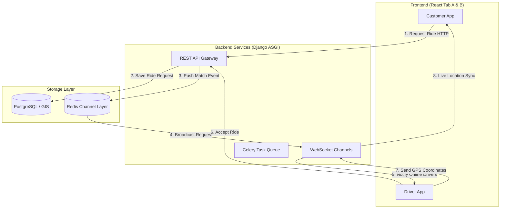

# NQTaxi Backend Blueprint & Integration Roadmap

This document provides a comprehensive step-by-step guide to complete the Django backend for NQTaxi and connect it with your React frontend. It uses the existing folder structure and pre-configured settings (Django REST Framework, simple-JWT, Django Channels for WebSockets, and Celery).

---

## 🏛️ System Architecture



---

## 📂 Django Application Structure & Modules

The NQTaxi project is designed as a modular Django monolith with **11 micro-apps** inside `backend/apps/`. This modular structure keeps codebase domain boundaries clean:

| # | Django App | Purpose | Contains Models? | Core Models |
|---|---|---|---|---|
| 1 | `users` | User registration, authentication, permissions, and roles (Rider/Driver/Admin) | **Yes** | `User`, `UserAddress` |
| 2 | `drivers` | Driver-specific profiles, online availability status, active vehicle binding | **Yes** | `DriverProfile`, `Vehicle`, `DriverDocument` |
| 3 | `rides` | Core ride matching, OTP verification, ride status workflow, ratings | **Yes** | `Ride`, `RideTracking`, `RideRating` |
| 4 | `payments` | Transactions, customer wallets, wallet transactions, invoices | **Yes** | `Transaction`, `Wallet`, `WalletTransaction`, `Invoice` |
| 5 | `notifications` | User in-app notifications, FCM push token storage | **Yes** | `Notification`, `DeviceToken` |
| 6 | `tracking` | WebSocket Consumers & geolocation handling | No | *(Uses `rides.RideTracking` for DB)* |
| 7 | `fare` | Calculation rules for base fares, dynamic pricing, surge rates | No | *Service layers & math helper utilities* |
| 8 | `promotions` | Promo codes, coupon discounts, system campaigns | No | *In-memory/Config-based coupon models* |
| 9 | `support` | Help tickets, customer support contact logic | No | *Read-only/API proxy layers* |
| 10 | `reports` | Analytics generation, driver earnings exports, CSV dumps | No | *Utility tasks* |
| 11 | `vehicles` | Global configurations of accepted vehicle types and specifications | No | *Admin-defined config arrays* |

---

## 💾 Database Schema & Table Specifications

To achieve a production-ready setup, the system consists of **14 custom database tables** across the 5 model-bearing applications, plus **Django default system tables** (for sessions, migrations, admin logging, and group permissions).

### 1. `users` App Models

#### Table 1: `users` (`User` model)
Handles Django authentication. Modified to include the persistent **Rider Ride OTP** created on signup:
* **Fields**:
  * `id`: `UUID` (Primary Key, default=uuid4)
  * `email`: `VARCHAR(255)` (Unique, User identifier)
  * `phone_number`: `VARCHAR(15)` (Unique)
  * `first_name`: `VARCHAR(100)`
  * `last_name`: `VARCHAR(100)`
  * `role`: `VARCHAR(10)` (Choices: `'RIDER'`, `'DRIVER'`, `'ADMIN'`, default `'RIDER'`)
  * `profile_picture`: `VARCHAR(100)` (Image path, nullable)
  * `is_active`: `BOOLEAN` (default True)
  * `is_staff`: `BOOLEAN` (default False)
  * `is_verified`: `BOOLEAN` (default False)
  * `otp`: `VARCHAR(4)` (Nullable - Persistent customer OTP for rides. Created during Rider registration)
  * `created_at`: `DATETIME` (auto_now_add)
  * `updated_at`: `DATETIME` (auto_now)

#### Table 2: `user_addresses` (`UserAddress` model)
* **Fields**:
  * `id`: `UUID` (Primary Key, default=uuid4)
  * `user_id`: `UUID` (Foreign Key to `users.id`, on_delete=CASCADE)
  * `label`: `VARCHAR(100)` (e.g. "Home", "Work")
  * `address_type`: `VARCHAR(10)` (Choices: `'HOME'`, `'WORK'`, `'OTHER'`)
  * `address_line`: `TEXT`
  * `latitude`: `DECIMAL(9, 6)`
  * `longitude`: `DECIMAL(9, 6)`
  * `is_default`: `BOOLEAN`
  * `created_at`: `DATETIME`

---

### 2. `drivers` App Models

#### Table 3: `driver_profiles` (`DriverProfile` model)
* **Fields**:
  * `id`: `UUID` (Primary Key, default=uuid4)
  * `user_id`: `UUID` (OneToOne Key to `users.id`, on_delete=CASCADE)
  * `license_number`: `VARCHAR(50)` (Unique)
  * `license_expiry`: `DATE`
  * `availability_status`: `VARCHAR(10)` (Choices: `'ONLINE'`, `'OFFLINE'`, `'ON_RIDE'`)
  * `rating`: `DECIMAL(3, 2)` (default 0.00)
  * `total_rides`: `INTEGER` (default 0)
  * `total_earnings`: `DECIMAL(12, 2)` (default 0.00)
  * `current_latitude`: `DECIMAL(9, 6)` (Nullable)
  * `current_longitude`: `DECIMAL(9, 6)` (Nullable)
  * `last_location_update`: `DATETIME` (Nullable)
  * `is_approved`: `BOOLEAN` (default False)
  * `created_at`: `DATETIME`
  * `updated_at`: `DATETIME`

#### Table 4: `vehicles` (`Vehicle` model)
* **Fields**:
  * `id`: `UUID` (Primary Key, default=uuid4)
  * `driver_id`: `UUID` (Foreign Key to `driver_profiles.id`, on_delete=CASCADE)
  * `vehicle_type`: `VARCHAR(15)` (Choices: `'SEDAN'`, `'SUV'`, `'HATCHBACK'`, `'AUTO'`, `'BIKE'`, `'PREMIUM'`)
  * `make`: `VARCHAR(100)` (e.g. "Toyota")
  * `model`: `VARCHAR(100)` (e.g. "Prius")
  * `year`: `INTEGER`
  * `color`: `VARCHAR(50)`
  * `registration_number`: `VARCHAR(20)` (Unique)
  * `is_active`: `BOOLEAN` (default True)
  * `created_at`: `DATETIME`

#### Table 5: `driver_documents` (`DriverDocument` model)
* **Fields**:
  * `id`: `UUID` (Primary Key, default=uuid4)
  * `driver_id`: `UUID` (Foreign Key to `driver_profiles.id`, on_delete=CASCADE)
  * `document_type`: `VARCHAR(15)` (Choices: `'LICENSE'`, `'REGISTRATION'`, `'INSURANCE'`, `'AADHAR'`, `'PAN'`)
  * `document_file`: `VARCHAR(100)` (File upload path)
  * `verification_status`: `VARCHAR(10)` (Choices: `'PENDING'`, `'APPROVED'`, `'REJECTED'`, default `'PENDING'`)
  * `rejection_reason`: `TEXT` (Nullable)
  * `uploaded_at`: `DATETIME`
  * `verified_at`: `DATETIME` (Nullable)

---

### 3. `rides` App Models

#### Table 6: `rides` (`Ride` model)
Stores all attributes of a ride transaction. Uses the 4-digit ride OTP at trip startup:
* **Fields**:
  * `id`: `UUID` (Primary Key, default=uuid4)
  * `rider_id`: `UUID` (Foreign Key to `users.id`, on_delete=CASCADE)
  * `driver_id`: `UUID` (Foreign Key to `driver_profiles.id`, Nullable, on_delete=SET_NULL)
  * `vehicle_type`: `VARCHAR(15)`
  * `status`: `VARCHAR(15)` (Choices: `'REQUESTED'`, `'SEARCHING'`, `'ACCEPTED'`, `'DRIVER_ARRIVED'`, `'IN_PROGRESS'`, `'COMPLETED'`, `'CANCELLED'`)
  * `payment_method`: `VARCHAR(10)` (Choices: `'CASH'`, `'ONLINE'`, `'WALLET'`)
  * `pickup_address`: `TEXT`
  * `pickup_latitude`: `DECIMAL(9, 6)`
  * `pickup_longitude`: `DECIMAL(9, 6)`
  * `dropoff_address`: `TEXT`
  * `dropoff_latitude`: `DECIMAL(9, 6)`
  * `dropoff_longitude`: `DECIMAL(9, 6)`
  * `estimated_distance_km`: `DECIMAL(8, 2)` (Nullable)
  * `actual_distance_km`: `DECIMAL(8, 2)` (Nullable)
  * `estimated_duration_minutes`: `INTEGER` (Nullable)
  * `actual_duration_minutes`: `INTEGER` (Nullable)
  * `estimated_fare`: `DECIMAL(10, 2)` (Nullable)
  * `actual_fare`: `DECIMAL(10, 2)` (Nullable)
  * `surge_multiplier`: `DECIMAL(4, 2)` (default 1.00)
  * `cancelled_by_id`: `UUID` (Foreign Key to `users.id`, Nullable)
  * `cancellation_reason`: `TEXT` (Nullable)
  * `ride_otp`: `VARCHAR(4)` (Nullable - Populated with rider's persistent profile `otp` code during ride request)
  * `requested_at`: `DATETIME`
  * `accepted_at`: `DATETIME` (Nullable)
  * `started_at`: `DATETIME` (Nullable)
  * `completed_at`: `DATETIME` (Nullable)
  * `cancelled_at`: `DATETIME` (Nullable)

#### Table 7: `ride_tracking` (`RideTracking` model)
* **Fields**:
  * `id`: `UUID` (Primary Key, default=uuid4)
  * `ride_id`: `UUID` (Foreign Key to `rides.id`, on_delete=CASCADE)
  * `latitude`: `DECIMAL(9, 6)`
  * `longitude`: `DECIMAL(9, 6)`
  * `timestamp`: `DATETIME`

#### Table 8: `ride_ratings` (`RideRating` model)
* **Fields**:
  * `id`: `UUID` (Primary Key, default=uuid4)
  * `ride_id`: `UUID` (OneToOne Key to `rides.id`, on_delete=CASCADE)
  * `rated_by_id`: `UUID` (Foreign Key to `users.id`, on_delete=CASCADE)
  * `rating`: `SMALLINT` (1 to 5)
  * `review`: `TEXT` (Nullable)
  * `created_at`: `DATETIME`

---

### 4. `payments` App Models

#### Table 9: `transactions` (`Transaction` model)
* **Fields**:
  * `id`: `UUID` (Primary Key, default=uuid4)
  * `ride_id`: `UUID` (OneToOne Key to `rides.id`, on_delete=CASCADE)
  * `payer_id`: `UUID` (Foreign Key to `users.id`, on_delete=CASCADE)
  * `amount`: `DECIMAL(10, 2)`
  * `currency`: `VARCHAR(3)` (default 'INR')
  * `status`: `VARCHAR(10)` (Choices: `'PENDING'`, `'COMPLETED'`, `'FAILED'`, `'REFUNDED'`)
  * `payment_gateway`: `VARCHAR(10)` (Choices: `'RAZORPAY'`, `'STRIPE'`, `'CASH'`, `'WALLET'`)
  * `gateway_transaction_id`: `VARCHAR(255)` (Nullable)
  * `gateway_response`: `JSON` (Nullable)
  * `created_at`: `DATETIME`
  * `updated_at`: `DATETIME`

#### Table 10: `wallets` (`Wallet` model)
* **Fields**:
  * `id`: `UUID` (Primary Key, default=uuid4)
  * `user_id`: `UUID` (OneToOne Key to `users.id`, on_delete=CASCADE)
  * `balance`: `DECIMAL(12, 2)` (default 0.00)
  * `updated_at`: `DATETIME`

#### Table 11: `wallet_transactions` (`WalletTransaction` model)
* **Fields**:
  * `id`: `UUID` (Primary Key, default=uuid4)
  * `wallet_id`: `UUID` (Foreign Key to `wallets.id`, on_delete=CASCADE)
  * `transaction_type`: `VARCHAR(6)` (Choices: `'CREDIT'`, `'DEBIT'`)
  * `amount`: `DECIMAL(10, 2)`
  * `description`: `TEXT`
  * `reference_id`: `UUID` (Nullable, references associated transaction/ride)
  * `created_at`: `DATETIME`

#### Table 12: `invoices` (`Invoice` model)
* **Fields**:
  * `id`: `UUID` (Primary Key, default=uuid4)
  * `ride_id`: `UUID` (OneToOne Key to `rides.id`, on_delete=CASCADE)
  * `transaction_id`: `UUID` (OneToOne Key to `transactions.id`, on_delete=CASCADE)
  * `invoice_number`: `VARCHAR(50)` (Unique)
  * `base_fare`: `DECIMAL(10, 2)`
  * `distance_charge`: `DECIMAL(10, 2)`
  * `time_charge`: `DECIMAL(10, 2)`
  * `surge_charge`: `DECIMAL(10, 2)`
  * `discount`: `DECIMAL(10, 2)`
  * `tax`: `DECIMAL(10, 2)`
  * `total_amount`: `DECIMAL(10, 2)`
  * `created_at`: `DATETIME`

---

### 5. `notifications` App Models

#### Table 13: `notifications` (`Notification` model)
* **Fields**:
  * `id`: `UUID` (Primary Key, default=uuid4)
  * `user_id`: `UUID` (Foreign Key to `users.id`, on_delete=CASCADE)
  * `notification_type`: `VARCHAR(20)` (Choices: `'RIDE_REQUEST'`, `'RIDE_ACCEPTED'`, etc.)
  * `title`: `VARCHAR(255)`
  * `message`: `TEXT`
  * `data`: `JSON` (Nullable, payload info like `ride_id`)
  * `is_read`: `BOOLEAN`
  * `created_at`: `DATETIME`

#### Table 14: `device_tokens` (`DeviceToken` model)
* **Fields**:
  * `id`: `UUID` (Primary Key, default=uuid4)
  * `user_id`: `UUID` (Foreign Key to `users.id`, on_delete=CASCADE)
  * `token`: `TEXT` (Unique device identifier)
  * `platform`: `VARCHAR(10)` (Choices: `'ANDROID'`, `'IOS'`, `'WEB'`)
  * `is_active`: `BOOLEAN`
  * `created_at`: `DATETIME`

---

### 📋 Summary of Database Tables Count

The database is composed of **14 Core Custom Tables** for NQTaxi business processes:
1. `users` (Core Auth & Roles with Rider's OTP)
2. `user_addresses` (Saved passenger favorites)
3. `driver_profiles` (Extended driver records)
4. `vehicles` (Associated driver cabs)
5. `driver_documents` (Verification registry)
6. `rides` (Active ride transaction & OTP check)
7. `ride_tracking` (GPS coordinates archive)
8. `ride_ratings` (Feedback records)
9. `transactions` (Invoice payment captures)
10. `wallets` (Passenger credits balance)
11. `wallet_transactions` (Balance ledgers)
12. `invoices` (Tax & detailed receipt breakdowns)
13. `notifications` (User notification center logs)
14. `device_tokens` (Push broadcast tokens)

#### Built-in & Django System Tables (8 Tables)
Django automatically provisions core system tables for management and security:
15. `django_session` (User session cache)
16. `django_migrations` (DB migration log tracker)
17. `django_content_type` (Internal model registry metadata)
18. `django_admin_log` (Staff dashboard action audit trails)
19. `auth_group` (User roles groups classification)
20. `auth_group_permissions` (Roles permissions join table)
21. `users_user_groups` (Users association with groups)
22. `users_user_permissions` (Explicit permissions assigned directly to specific users)

**Total Database Tables (Production-Ready Instance): 22 Tables**

---

## 📌 Implementation Checklist & Step-by-Step Roadmap

| Phase | Title | Goal | Key Files |
| :--- | :--- | :--- | :--- |
| **Phase 1** | Environment & DB Setup | Configure Python, SQLite/PostgreSql, and start Redis server | `.env`, `requirements.txt` |
| **Phase 2** | Auth & Roles API | Implement JWT login/register with registration OTPs | `apps.users.models`, `views.py` |
| **Phase 3** | Ride Lifecycle API | Create ride booking, driver radar matchmaking, and OTP checks | `apps.rides.views`, `models.py` |
| **Phase 4** | WebSocket Integration | Implement real-time channel handlers for GPS tracking | `apps.rides.consumers`, `routing.py` |
| **Phase 5** | Frontend-Backend Connect | Replace frontend mock layers with active API calls | `frontend/src/services/api.js` |
| **Phase 6** | Testing & Production | Run test suites, configure Gunicorn/Uvicorn, and deploy | `docker-compose.yml`, `wsgi/asgi.py` |

---

## ⚙️ Phase 1: Environment & Database Setup
Initialize your local Python environment and configure Django to connect to your database.

### Steps:
1. **Initialize Virtual Environment**:
   Run these commands inside the `backend/` directory:
   ```bash
   python -m venv venv
   .\venv\Scripts\activate   # Windows
   pip install -r requirements.txt
   ```
2. **Setup Local Environment Variables**:
   Create a `.env` file in the `backend/` root directory (copy from `.env.example`):
   ```ini
   DEBUG=True
   SECRET_KEY=django-insecure-development-token-123
   ALLOWED_HOSTS=localhost,127.0.0.1
   DB_ENGINE=django.db.backends.sqlite3 # Or django.contrib.gis.db.backends.postgis
   DB_NAME=db.sqlite3
   REDIS_URL=redis://localhost:6379/1
   ```
3. **Start Redis Server**:
   Start a local Redis instance (required by Django Channels for WebSockets and Celery):
   ```bash
   docker run -p 6379:6379 -d redis
   ```
4. **Run Migrations & Create Admin User**:
   ```bash
   python manage.py migrate
   python manage.py createsuperuser
   python manage.py runserver
   ```

---

## 🔑 Phase 2: User Authentication & Profiles (REST)
Replace the frontend `authService.js` local storage mock with real JWT token authentication.

### Steps:
1. **Complete `User` Model**:
   Ensure [apps/users/models.py](file:///c:/Users/DELL/Documents/DemoNQTaxi/NQTaxi/backend/apps/users/models.py) supports registration details, OTP numbers, and user types (`RIDER`, `DRIVER`, `ADMIN`).
2. **Implement Simple-JWT Authentication**:
   Verify endpoints for `/api/token/` (login) and `/api/token/refresh/` are exposed inside `backend/nqtaxi/urls.py`.
3. **Registration & OTP Generation View**:
   Write a registration serializer that:
   * Generates a 4-digit persistent OTP (`otp`) for the user profile if the user is a `RIDER`.
   * Sends a simulated SMS/Email OTP code for validation.

---

## 🚕 Phase 3: REST API for Ride Booking Lifecycle
Implement API endpoints for the ride lifecycle inside the `apps.rides` application.

```
       [Rider Requests]          [Driver Arrives]          [Trip Finishes]
REQUESTED ───────────► ACCEPTED ────────────► IN_PROGRESS ─────────────► COMPLETED
                      (Driver details         (Requires OTP
                       sent to Rider)          verification)
```

### Steps:
1. **Booking Endpoint (`POST /api/rides/`)**:
   Allows a logged-in Rider to create a `Ride` request. It retrieves the rider's persistent profile OTP and saves it as `ride_otp` on the ride record.
2. **Driver Radar matching (`GET /api/rides/radar/`)**:
   Fetches pending ride requests (status=`REQUESTED`) matching the active driver's vehicle type.
3. **Trip Verification API (`POST /api/rides/<uuid:id>/start/`)**:
   * Accepts the input parameter `otp`.
   * Verifies that the input matches the passenger's persistent OTP `ride_otp`.
   * Updates ride status to `IN_PROGRESS` and logs `started_at` timestamp.

---

## 📡 Phase 4: WebSocket Real-Time Tracking (Channels)
Configure full duplex WebSockets to allow drivers to stream coordinates, and riders to watch coordinates update on their map in real-time.

### Steps:
1. **Configure Routing**:
   Update `apps/rides/routing.py` to route WebSocket requests:
   ```python
   from django.urls import path
   from . import consumers

   websocket_urlpatterns = [
       path('ws/rides/<uuid:ride_id>/', consumers.RideTrackingConsumer.as_asgi()),
   ]
   ```
2. **Flesh out Location Tracking Consumer**:
   Verify `apps/rides/consumers.py` connects drivers to the channels Redis room. When a driver sends location coordinates:
   ```json
   { "latitude": 12.9716, "longitude": 77.5946, "timestamp": "2026-06-25T11:00:00Z" }
   ```
   Save the breadcrumb coordinate into the `RideTracking` table, and broadcast the coordinate immediately to the rider tab.

---

## 🔗 Phase 5: Connecting Frontend to Backend
Once your Django APIs are running, update the React files to talk to the backend instead of using localStorage.

### Steps:
1. **Setup API Client (`api.js`)**:
   Create a centralized axios instance that handles attaching JWT tokens in headers:
   ```javascript
   import axios from 'axios';
   const api = axios.create({ baseURL: 'http://localhost:8000/api/' });
   // Inject JWT headers automatically
   api.interceptors.request.use((config) => {
     const token = sessionStorage.getItem('access_token');
     if (token) config.headers.Authorization = `Bearer ${token}`;
     return config;
   });
   ```
2. **Connect Customer Booking Page**:
   Update `onBookingConfirmed` in React to post to `POST /api/rides/` instead of saving a mock localStorage booking.
3. **Establish WebSocket Listeners in React**:
   In `DriverOnTheWay.jsx` or `RideInProgress.jsx`, open a WebSocket client pointing to the ASGI server:
   ```javascript
   const socket = new WebSocket(`ws://localhost:8000/ws/rides/${rideId}/`);
   socket.onmessage = (event) => {
     const data = json.parse(event.data);
     if (data.type === 'location_update') {
       // Update map markers dynamically with real latitude/longitude
     }
   };
   ```

---

## 📦 Phase 6: Production Deployment & Scaling
How to run the application in a production-ready cloud environment.

### Steps:
1. **Containerize Service**:
   Create a `docker-compose.yml` defining services for **Django (web)**, **Uvicorn/Daphne (asgi-websockets)**, **PostgreSQL + PostGIS (db)**, **Redis (queue/channels)**, and **Celery (workers)**.
2. **Production WSGI/ASGI Servers**:
   * Use **Gunicorn** to host standard REST traffic.
   * Use **Uvicorn** or **Daphne** to handle high-frequency concurrent WebSocket connections.
3. **Geospatial Queries (PostGIS)**:
   For production scaling, change SQLite3 databases to **PostgreSQL with PostGIS extensions**. Use Django's spatial query functions (`dwithin`, `distance`) to calculate the closest online drivers to a rider's pickup latitude/longitude.
